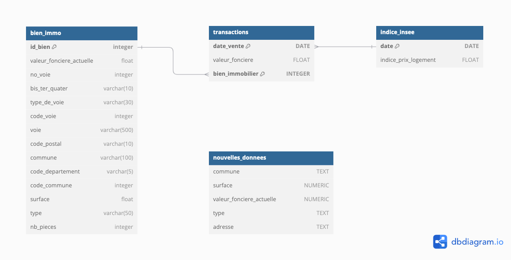

# Base de donnée immobilière

Cet exercice a pour but de présenter une implémentation possible d'une base de données pour une agence immobilière. L'objectif est de démontrer comment implémenter et exécuter des recherches de biens selon des critères définis.

**La base de données est composée de 4 tables :**


Image source : [dbdiagram.io](https://dbdiagram.io/)

## Description des tables

1. La table `bien_immo` contient la liste des biens immobiliers, incluant :

   - L'id du bien `clé primaire`
   - La valeur foncière actuelle du bien
   - L'adresse `[no_voie, bis_ter_quater, type_de_voie, code_voie, voie, code_postal, commune, code_departement, code_commune]`
   - Surface du bien
   - Nombre de pièces
   - Type de bien (appartement ou maison)

2. La table `transactions` liste les ventes réalisées sur les 6 premiers mois de 2020. Elle comprend :

   - La date de vente
   - la valeur foncière lors de la vente _(la valeur foncière peut évoluer et être différente de la valeur actuelle du bien)_
   - La `référence` vers le `bien_immo` concerné _(clé étrangère vers la table bien_immo)_.

> Un bien immobilier peut apparaître plusieurs fois, car il peut avoir été vendu plusieurs fois.
> Les `clés primaires` de la table `transactions` sont `[date_vente, bien_immobilier]`.

3. La table `indice_insee` donne pour chaque date de la période concernée l'indice des prix immobiliers de la région calculé par l'Insee _(Institut national de la statistique et des études économiques)_.
   Si l'indice est élevé, cela indique que les prix immobiliers dans la région sont élevés.

4. La table `nouvelles_donnees` permet de créer une `UNION` avec la table `bien_ommo`.

## Docker compose

Je vous propose d'utiliser Docker pour installer proprement MySQL et phpMyAdmin. Utilisez les commandes suivantes pour installer les différents conteneurs, initialiser la base de données, créer les tables et insérer les données.
Toutes les commandes d'initialisation sont disponibles dans le fichier [docker-compose](./docker-compose.yml).

1. Initialisez les conteneurs Docker avec la commande :

```bash
   docker compose up --build
```

2. Ouvrez phpMyAdmin pour voir la base de données immo depuis le navigateur, [http://localhost:8080/]

Si vous souhaitez accéder à MySQL depuis le terminal, utilisez :

```bash
   docker exec -it mysql mysql -u root -p
   USE immo;
   ...query voir fichier query.sql
```

Le mot de passe pour le conteneur MySQL est `root` voir fichier `docker-compose.yml`.

3. Pour exécuter le fichier d'initialisation et de peuplement de la base de données, utilisez :

```bash
   docker exec -i mysql mysql -u root -proot immo < ./init/init.sql
```

4. Pour supprimer les conteneurs, utilisez :

```bash
   docker compose down
```

## Requêtes SQL

Les requêtes SQL ainsi que leurs résultats attendus sont disponibles dans le fichier [query.sql](./query.sql).

Voici quelques exemples de requêtes SQL incluses :

1. Nombre de biens immobiliers vendus par mois pour chaque mois de l'année
   Cette requête affiche le nombre de ventes immobilières par mois.

```sql
SELECT DATE_FORMAT(date_vente, '%Y-%m') AS mois, COUNT(*) AS nb_ventes
    FROM transactions
    WHERE MONTH(date_vente) = '01'
    GROUP BY mois
    ORDER BY mois DESC;
```

2. Union de données entre la table `bien_immo` et la table `nouvelles_donnees`
   Cette requête permet d'obtenir la liste de tous les biens disponibles à la vente.

```sql
SELECT valeur_fonciere_actuelle, commune, ROUND(surface, 2) AS surface, type
   FROM bien_immo
      UNION
SELECT valeur_fonciere_actuelle, commune, ROUND(surface, 2) AS surface, type
   FROM nouvelles_donnees
   ORDER BY commune ASC;
```

3. Calcul du nombre de biens immobiliers vendus par commune, du prix moyen au m², et de la valeur foncière totale par commune
   Cette requête permet d'obtenir des informations détaillées sur les transactions par commune.

```sql
SELECT
    code_departement,
    commune,
    count(*) AS nombre_de_biens,
    ROUND(sum(valeur_fonciere_actuelle), 2) AS valeur_fonciere,
    ROUND(sum(surface), 2) AS surface,
    ROUND(sum(valeur_fonciere_actuelle) / sum(surface),2) AS prix_m2
FROM
    bien_immo
GROUP BY
    code_departement, commune;
```

Pour plus de détails et d'exemples, consultez le fichier [query.sql](./query.sql).
